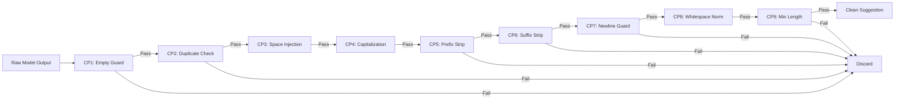

<div align="center">


**✨ AI-Powered Line Completion Engine for Document Editors ✨**

[](https://fastapi.tiangolo.com/)
[](https://developer.mozilla.org/en-US/docs/Web/API/WebSocket)
[](https://gemini.google.com/)
[](https://python.org)

<p align="center">
  
</p>

</div>

---

## 🚀 What is Synnoia?

Synnoia is a high-performance, AI-driven line completion engine that provides intelligent text suggestions in real-time. Built with **FastAPI** and powered by **Google Gemini**, it uses **WebSocket** connections for instant, bidirectional communication with document editors.

### ✨ Key Features

| Feature | Description | Status |
|---------|-------------|--------|
| ⚡ **Real-time Suggestions** | WebSocket-powered instant completions | ✅ Active |
| 🧠 **Google Gemini AI** | State-of-the-art language model | ✅ Active |
| 💾 **LRU Cache** | 500-entry cache with MD5 key hashing | ✅ Active |
| 🔒 **9 Smart Checkpoints** | Post-processing pipeline for quality | ✅ Active |
| 📊 **Cache Statistics** | Monitor cache hit rates via endpoint | ✅ Active |
| 🎨 **HTML Test Client** | Beautiful web-based testing interface | ✅ Active |
| 🚄 **Railway Ready** | One-click deployment configuration | ✅ Active |

---

## 🏗️ Architecture

```
┌─────────────────┐     WebSocket      ┌──────────────────┐
│   Document      │◄──────────────────►│   Synnoia Server   │
│   Editor        │   JSON Protocol    │   (FastAPI)        │
└─────────────────┘                    └────────┬───────────┘
                                               │
                         ┌─────────────────────┼─────────────────────┐
                         │                     │                     │
                         ▼                     ▼                     ▼
                ┌──────────────┐    ┌──────────────────┐   ┌──────────────┐
                │   LRU Cache  │    │  9 Checkpoints   │   │   Gemini AI  │
                │  (500 max)   │    │  Post-Processing │   │   (Google)   │
                └──────────────┘    └──────────────────┘   └──────────────┘
```

---

## 🎯 The 9 Checkpoints Pipeline

Every suggestion passes through 9 deterministic checkpoints for quality assurance:



| # | Checkpoint | Action | Returns None If |
|---|------------|--------|-----------------|
| 1 | **Empty Guard** | Filters blank output | Empty or whitespace-only |
| 2 | **Duplicate Check** | Prevents prefix duplication | Already exists in prefix tail |
| 3 | **Space Injection** | Adds/removes boundary spaces | - (always passes) |
| 4 | **Capitalization** | Uppercases after `.!?` | - (always passes) |
| 5 | **Prefix Strip** | Removes repeated prefix words | Result becomes empty |
| 6 | **Suffix Strip** | Removes overlapping suffix | Result becomes empty |
| 7 | **Newline Guard** | Truncates at `\n` | Result becomes empty |
| 8 | **Whitespace Norm** | Collapses multiple spaces | - (always passes) |
| 9 | **Min Length** | Filters short suggestions | < 3 characters |

---

## 🚀 Quick Start

### Prerequisites

- Python 3.11+
- Google Gemini API Key

### Installation

```bash
# Clone the repository
git clone https://github.com/yourusername/synnoia-tab.git
cd synnoia-tab

# Create virtual environment
python -m venv .venv
source .venv/bin/activate  # On Windows: .venv\Scripts\activate

# Install dependencies
pip install -r requirements.txt
```

### Environment Setup

Create a `.env` file:

```env
GOOGLE_API_KEY=your_gemini_api_key_here
```

### Run Locally

```bash
# Start the server
uvicorn app.main:app --host 0.0.0.0 --port 8000

# Open test client
# Open test_client.html in your browser
```

---

## 📡 API Documentation

### WebSocket Endpoint

```
ws://localhost:8000/ws
```

#### Request Format

```json
{
  "prefix_text": "Hello my name is",
  "suffix_text": "and I love coding."
}
```

#### Response Format

```json
{
  "suggestion": " Arslan ",
  "cached": false
}
```

#### Error Response

```json
{
  "error": "Missing required fields: prefix_text and suffix_text"
}
```

### HTTP Endpoints

| Endpoint | Method | Description |
|----------|--------|-------------|
| `/` | GET | Health check - returns `{"Hello": "World"}` |
| `/cache-stats` | GET | Cache statistics - returns `{"size": N, "maxsize": 500}` |

---

## 🎨 Test Client

The project includes a beautiful HTML test client with:

- 🔴🟢 **Live connection status** indicator
- 📝 **Prefix & Suffix** input fields
- 📤 **Send requests** with WebSocket
- 📥 **Real-time responses** with cache badges
- 📜 **Request history** tracking
- ⌨️ **Keyboard shortcuts** (Ctrl+Enter to send)

<div align="center">


</div>

---

## 🚄 Deployment

### Railway (Recommended)

```bash
# Install Railway CLI
npm i -g @railway/cli

# Login and deploy
railway login
railway init
railway up

# Set environment variable
railway vars set GOOGLE_API_KEY=your_key_here
```

### Local with Docker

```dockerfile
FROM python:3.11-slim

WORKDIR /app
COPY requirements.txt .
RUN pip install -r requirements.txt

COPY . .

CMD ["uvicorn", "app.main:app", "--host", "0.0.0.0", "--port", "8000"]
```

---

## 🔧 Configuration

### Model Parameters

```python
model = ChatGoogleGenerativeAI(
    model="gemini-3-flash-preview",
    temperature=0.3,        # Lower = more focused
    max_tokens=64,           # Short completions
    stop=["\n\n"],           # Stop at paragraph breaks
    top_p=0.9,              # Nucleus sampling
    top_k=40                # Top-k sampling
)
```

### Cache Configuration

```python
cache = LRUCache(maxsize=500)  # 500 entries
```

---

## 🧪 Testing

### Manual Testing

1. Start the server: `uvicorn app.main:app --host 0.0.0.0 --port 8000`
2. Open `test_client.html` in browser
3. Enter prefix/suffix and click "Send Request"
4. Observe response with cache status

### Automated Testing

```python
# Example test script
import asyncio
import websockets
import json

async def test():
    async with websockets.connect("ws://localhost:8000/ws") as ws:
        await ws.send(json.dumps({
            "prefix_text": "The weather today is",
            "suffix_text": "and I plan to go outside."
        }))
        response = await ws.recv()
        print(response)

asyncio.run(test())
```

---

## 📊 Performance

| Metric | Value |
|--------|-------|
| **Cache Hit** | ~0.1ms response time |
| **Cache Miss** | ~500-1000ms (model inference) |
| **Cache Size** | 500 entries |
| **Key Hashing** | MD5 of normalized prefix+suffix |
| **WebSocket** | Persistent connection |

---

## 🛡️ Error Handling

The system handles errors gracefully:

- **Empty inputs** → Returns error message
- **Model errors** → Returns "Error: ..." (not cached)
- **Checkpoint filtered** → Silently discarded
- **WebSocket disconnect** → Cleans up connection

---

## 📝 Project Structure

```
synnoia-tab/
├── app/
│   ├── __init__.py
│   ├── main.py              # FastAPI + WebSocket handler
│   └── model/
│       ├── __init__.py
│       └── suggestion_model.py # Model + Cache + Checkpoints
├── .env                      # Environment variables
├── .gitignore
├── Procfile                  # Railway deployment
├── requirements.txt          # Python dependencies
├── test_client.html          # Web-based test client
└── README.md                 # This file
```

---

## 🤝 Contributing

Contributions welcome! Please follow these steps:

1. Fork the repository
2. Create a feature branch (`git checkout -b feature/amazing-feature`)
3. Commit changes (`git commit -m 'Add amazing feature'`)
4. Push to branch (`git push origin feature/amazing-feature`)
5. Open a Pull Request

---

## 📄 License

MIT License - see [LICENSE](LICENSE) file

---

## 🙏 Acknowledgments

- [FastAPI](https://fastapi.tiangolo.com/) - Web framework
- [LangChain](https://langchain.com/) - LLM framework
- [Google Gemini](https://gemini.google.com/) - AI model
- [cachetools](https://cachetools.readthedocs.io/) - LRU cache
- [Railway](https://railway.app/) - Deployment platform

---

<div align="center">

**Made with ❤️ by Synnoia Team**

<p align="center">
  
</p>

</div>
